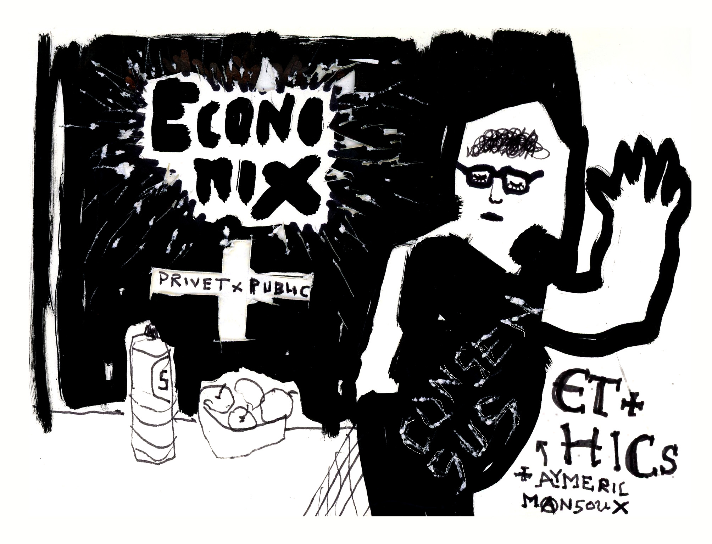
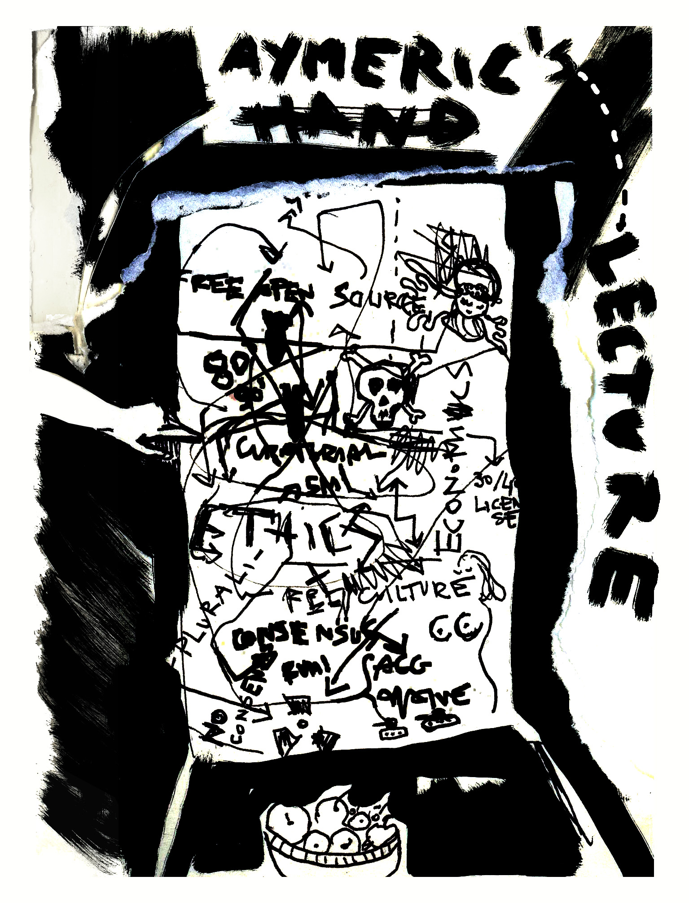
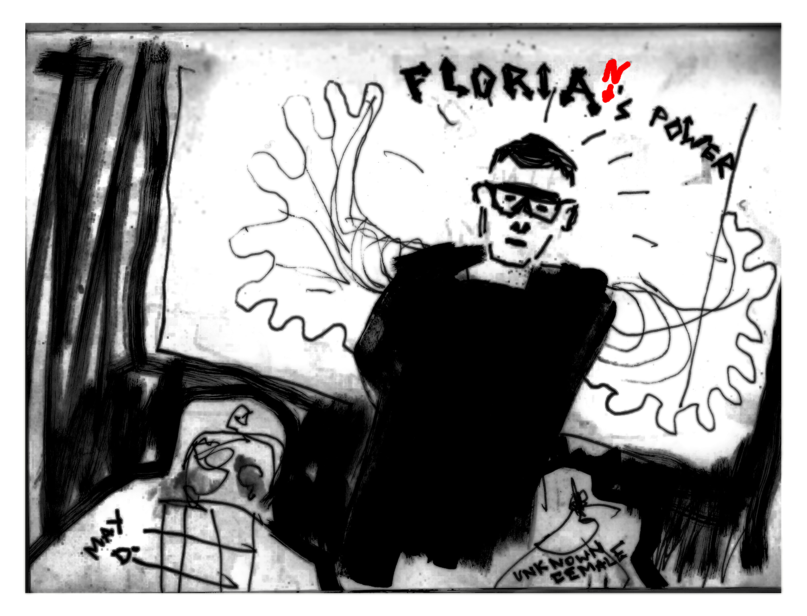
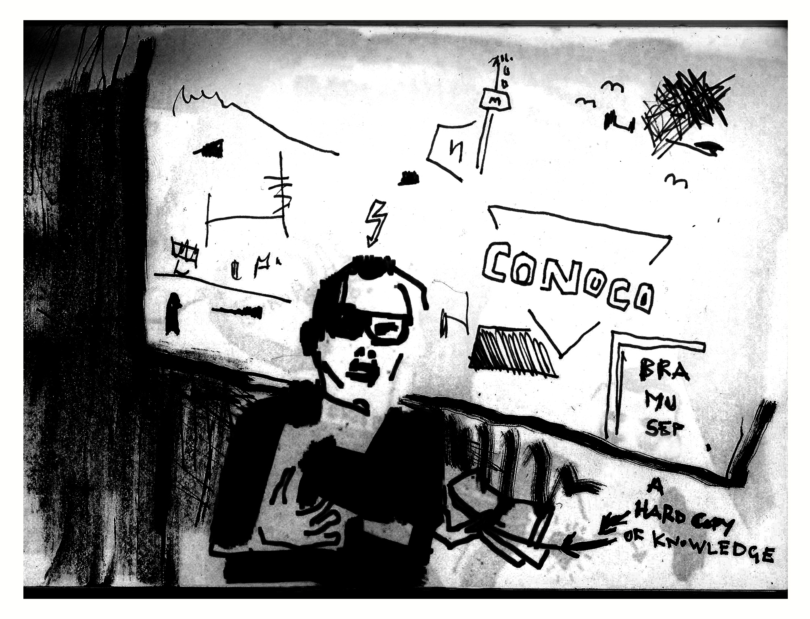
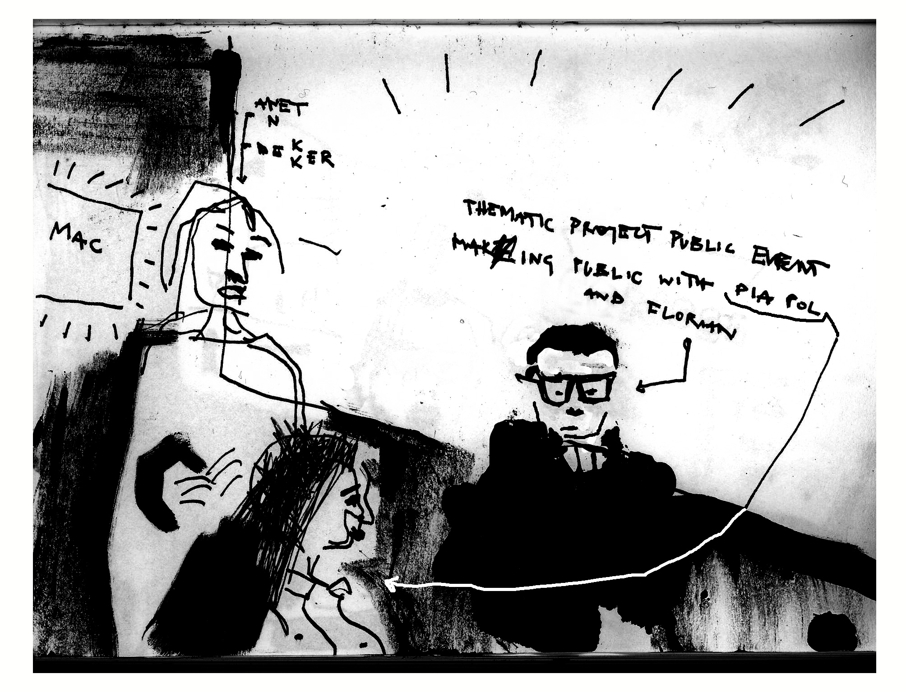
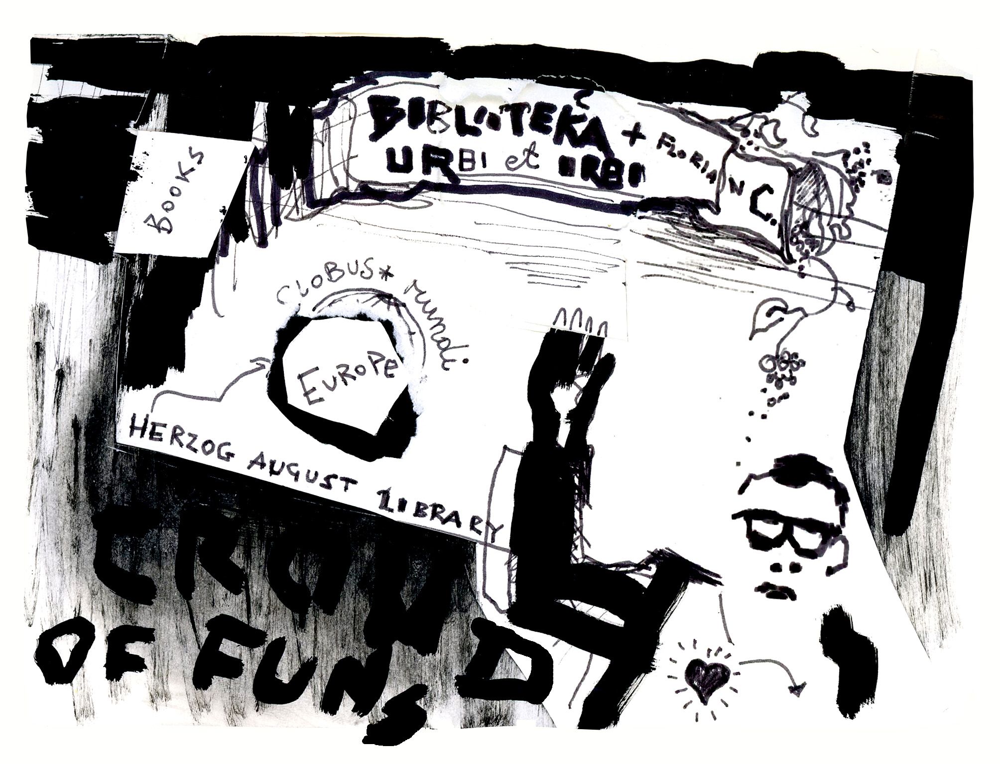
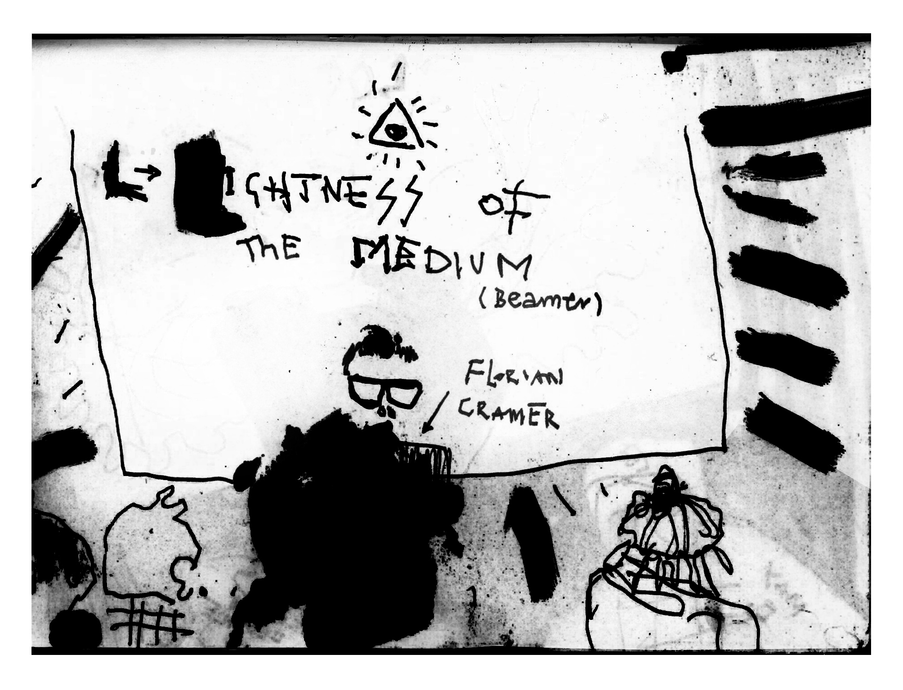

---
generator: pandoc
viewport: 'width=device-width, initial-scale=1.0, user-scalable=yes'
...

Making It Public – 2 to 4 Nov 2015 {#making-it-public-2-to-4-nov-2015 span="report"}
==============================================================

### Introduction

The thematic workshop looked at modes of public distribution and the
difficulties faced in shifting private sources of knowledge into the
public terrain. The prospect of knowledge sharing within the public
sphere presents the idealistic model of free education, open culture and
equality of opinions.The term *‘private’* entails the right to express
one’s subjective opinion and upholds the validity of one’s own voice and
interpretation. As a consequence of the attempt to move the *‘private’*
into the public sphere, the original intention becomes impinged through
the process of distribution. The nature of publicising content involves
acts of distortion, corruption of intent, curatorial and editorial
censorship and filtration. In order to present a coherent order of
discourse from the multiplicity of sources to promote apparent
*‘objectivity’*, it becomes necessary to undergo selection, exclusion
and inclusion.

 

Distribution Networks — Monday 2nd Nov
==================================================================

### The Game \#1 {#thegame}

Based upon the above stated texts, we devised a game that we felt was
representative of the readings.

We selected three objects to present to the class, each of which was
meant as a representative of a larger ideology an Aloe Vera Plant
*(ecology/health)* A Statuette with a plastic *(culture)* Bananas in a
plastic bag *(consumerism/property)* The class was then asked to each
select one object they felt somehow attached to and form groups around
each. The groups were then instructed to discuss their shared
appreciation of the objects - this instruction was given in hope of
creating a sense of community. The groups were also asked to select a
leader from the group as a public representative. Once these communities
were formed, and leaders selected, we informed the class that one of the
three objects had to be destroyed. The group leaders were given the
responsibility to step forward and defend the preservation of their
objects. After each leader presented a defence for their object to the
class, the class was asked to vote on which object was to be destroyed.
One object was destroyed With two objects remaining, we repeated the
experiment and asked the class to yet again cast a vote for which object
should be destroyed and which preserved. Ultimately the majority vote
ruled for one object to remain, all others were destroyed.

Our intention for this assignment was to inspire the individuals of our
class to form *‘communities’*, within the *‘society’* which we existed
in as a class. These communities would then naturally form into a
*‘mainstream’* majority as well as a diversity of *‘subcultures’*. These
separate communities were then asked to cast a vote which would decide
upon which communities *‘ideals’* would survive, in order to illustrate
various democratic models.

Our expectations of the experiment were that the majority of the group
would opt to be a part of the *‘BANANA COMMUNITY’*. This did occur
although when asked upon a second vote, we found that a large section of
the majority joined a *‘subculture’*. There are various possible
explanations for this:

-   Persuasive campaigning
-   The individual's of the class are naturally inclined to make part
    of subcultures. Even in this experiment, having found themselves
    within the Mainstream, they ultimately opted for a subculture.

The minority group convinced other groups to join them. The convincing
part is similar to media publishing and it was persuasive.

The culture being preserved is the propaganda's choice....

### Speaker \#1 {#speakers}

#### Making it public for who? {#making-it-public-for-who-aymeric}

###### – Aymeric Mansoux

Beginning with a short summary of the historical evolution of *Free
Software* and *Free Culture*, Aymeric questioned the blurring borders of
private and public concepts both in socio-political and digital space.
Between the years '99-'03 (the good years) digital intellectual property
could be released under various branches of licence, which offered legal
variations on release and authorship rights. *Richard Stallman*
developed the concept of the General Public Licence, which was intended
as a common space for collaboration, to share knowledge and exchange
ideas through the WorldWideWeb. The GPL was later divided into two
fractions; *Free Software* and *Open Source Software*, the two segments
standing in opposition to the dominant ideology of Neo-Liberal
Privatisation. These two communities, albeit sharing a similar approach,
were unable to come to a consensus on a legal model for sharing and
releasing intellectual property, as their ideologies strongly differed.

Aymeric Mansoux

*Eric S. Raymond*, advocating the OSS ideology, focusses primarily on
economic Interest. This argument supports the concept of *Open Source
Software* as far as its potential to improve products. *Richard
Stallman*, stands in opposition as a *‘software freedom activist’*,
envisioned an ethical model, which would respect the users’ freedom and
community. Allowing them the freedom to run, copy, distribute, study,
change and improve the software.

The two segments became increasingly fragmented as they came into the
era of pluralism, in which multiple modes of licensing were made
available to users, seemingly tailored to the individual's needs. These
were made available through the competitive climate created by the two
parallel communities, both of which adhering to their own differing
agendas. Agonistic model: competing, opening everything under differing
licence - power struggle, more choice for users. The golden era of
pluralism ended somewhere in 2003. Due to ideological and economic
bankruptcy, the various licensing models withdrew and formed into two
dominant blocks: *CC* and *Free Culture*. As the *Free Culture* movement
is driven by ethical.

Aymeric Mansoux's lecture

Deliberative models: Wikipedia! Free Culture -

Aggregative model: Creative Commons

### Speaker \#2 {#speakers}

#### Zines Camp {#zines-camp-amy-wu}

###### – Amy Wu

[Amy Wu](http://www.amysuowu.net/){.uri}, an alumni of the Piet Zwart
Institute, currently co-organises Zinecamp 2015, the 'Worm' Fanzine
festival. The festival is aimed at people who are interested in the
activity of independent publishing and the DIY ethos. The routes of the
Zine scene are firmly embedded within the American and British punk and
anarcho-punk subcultures of the 70s. The process of publishing with
minimal means by making fanzines provided the opportunity to various
individuals and ostracised communities to express themselves and
distribute amongst one other.

The second speaker that day was a former Piet Zwart student Amy Wu and
the current co-organizer of the Worm Fanzine festival: Zinecamp 2015:
(2nd time the event happens — in Worm) A festival aimed for people who
are interested in the (once) underground activity of independent
publishing and DIY ethos. Coming from the 70' U.S. and U.K. culture of
punk and anarcho-punk subculture, the process of publishing with minimal
means had made it easier for excluded communities or individuals to
express themselves through making fanzines. It was a way for unheard
voices, subcultures, or small communities to express themselves through
writing and publishing. We also had the privilege to see original copies
of the "beautiful" zines- a form of resistance to the social (and
visual) order.

### Speaker \#3 {#speakers}

#### The Man Who Wanted to\
Classify the World {#documentary-the-man-who-wanted-to-classify-the-world}

###### – Documentary

The documentary The Man Who Wanted to Classify the World, 2002,
illustrated the life and work of Paul Otlet. Paul Otlet's passion for
classification led him to perfect the Dewey Classification system and
developed it into 'the Universal Decimal Classification', a system still
in use in most libraries today. Otlet firmly believed that in the
distribution and accessibility of knowledge, mankind could reach peace.
The Universal City, a life lone project, assisted by the American
(posing as Danish) artist (posing as an architect) Hendrik Christian
Anderson. This involved plans for an actual city, which would host the
world's collected knowledge, for future generation to openly share, a
focus for harmonious, pacifist and progressive civilisation. After
several rejections

When Andersen in the mid-30's turned to the Italian dictator Mussolini
for support to build the city, Otlet turned away in disgust, but soon
found renewed support in the great architect Le Corbusier, who drew up
plans and assisted him to until the very end.

Paul Otlet can be said to be among the chief architects behind the
League of Nations (founded as a result of the Paris Peace Conference
that ended the First World War), a unifying body of peacemaking among
all nations, but even so his dreams of a permanent city of peace workers
- politicians, intellectuals, scientist and artists working towards the
abolition of war - was never recognized for real. And if it wasn't
enough that two world wars brought whole societies to their knees, and
with them the real-world effects of his firm belief in pacifism; petty
thinking in his own nation also destroyed his library and collections of
art and science. But even so his ideas of connecting all knowledge and
making it accessible in images, audio and instant connections to anyone,
anywhere, remained in the world. His is basically the modern version of
the story of the difficult birth of the interconnectedness, which we
today call "the Internet".

A beautiful documentary, "The Man Who Wanted To Classify The World", was
created by Francoise Levie for release by Sofidoc Productions in 2002,
following almost 1 year of opening and cataloguing the remains of his
personal papers: 100 mice infested crates and boxes documenting every
little thing in a life full of dreams, theory, planning, and action.
Paul Otlet threw nothing away. Even a torn up letter was saved in a
separate envelope. But out of the boxes grew a full life, where almost
no endeavour went awry:

He had found his voice and conviction in pacifism - springing from the
innate need to classify and put in order everything, which mankind
discovered, developed and thought - and this certainly carried him
throughout the whole of his life. Not a Ghandi, not a Martin Luther King
working among his people, but an intellectual working from a dream so
large that one would almost call it a pipe dream, if not for his total
conviction: That peace among all nations was possible, if only there was
a common focus on peace for all to see and believe in.

Writing the archive — Tuesday 3rd Nov
=====================================

### The Game \#2 {#thegame}

Assignment Group: Colm, Pleun, Sara In relation to the texts assigned
for this day, we decided to focus on Mathew Fuller's hypothesis which
takes McLuhan's statement, "A society is defined by its amalgamates, not
by its tools". This was the starting point.

We collected a set of tools whose functions are very specific and
uncommon among average users: an extension grip used for a cordless
drill, two clasp rings meant to hold pages together, a bike chain link
tool, a radiator key, and a disc from a label-making machine. We first
split the classroom into two groups, asking one of the groups to step
out of the room. We then instructed each member of the remaining group
to choose one tool and prepare an instruction manual for it. As most of
the people in the group didn't have any prior knowledge as to what the
items actually were or what function they served, the instruction manual
was left up to imagination.

Then, each member of the first group had to explain the instructions
they had prepared to a person from the second group but without showing
them the actual tool. Then, finally, the person receiving the
information had to repeat it to the whole class. The objects described
by the end of the exercise, of course, had nothing to do with the
original objects: a bike chain link tool became a pinching device, and a
label-disk became a device meant to communicate with aliens!

In this assignment, there were several layers of transmission: a first
layer between us and the first group, then between the first group and
the second group, and then between the second group and the whole class.
And in each of those layers of transmission, a power structure revealed
itself between those who behold information and those who receive it;
those who are capable of revealing through concealing, and concealing
through revealing, as Lori Emerson would describe in "Reading, Writing
Interface".

Reflecting on the argument on tools and society, Fuller states that a
program like Microsoft Word, for example, somehow defines our society;
not only by providing an excess of tools, but also by providing the
paths between those tools, how they intermix, the boundaries and
correlations between their functions, and especially, their relation to
the users. In this sense, Microsoft Office somehow offers a seires of
interfaces or points of transmission on several levels. The result
being, an over cluttered, illogical toolbox, with many overlaps and
double uses, which just confuses users, and simply means they end up
using a small handful of icons repeatedly, and never explore other
functions.

We live in a computing world that drowns its users with an excess of
tools, who's communications are locked in a 'user-friendly' yet
closed-off interface; a strategy that places the user inside an ideology
of obscured information, distorting reality by convincing the latter
that this is exactly what the notion of "user-friendly device" actually
is.

### Speaker \#4 {#speakers}

#### Writing Wikimedia {#writing-wikimedia-sandra-fauconnier}

###### – Sandra Fauconnier

Sandra Fauconnier is a Wikimedian. This is the term employed to name
contributors to Wikipedia. Sandra's career has always involved net art /
media art in some way, between the introduction that Annet gave and the
very beginning of Sandra's presentation, we hear briefly about her
experience at V2 here in Rotterdam, but very quickly get into the topic
of the talk.

How editing collective knowledge can be achieved by separation into
language communities and functional splitting. Sandra gives an overview
of the functionings of Wikipedia. She calls it an ecosystem. A scheme
with multiple parts that interdepend on each other. One of the key
features of the workings of Wikipedia, is that all tools are developed
to be used inside and outside of the context of Wikipedia.org itself.
The project constantly acknowledges it's origin by maintaining and
developing the tools necessary to achieve collective and individual
information banks, collectively. From Wikimedia itself:

Wikimedia is a global movement whose mission is to bring free
educational content to the world. Through various projects, chapters,
and the support structure of the non-profit Wikimedia Foundation,
Wikimedia strives to bring about a world in which every single human
being can freely share in the sum of all knowledge.

If everybody tries to contribute to all aspects of the building of a
wikipedia page, the system does not work properly. A good page should be
an amalgamation of multiple editors, multiple sources, and a discussion
on the quality of the page. So, who writes Wikipedia? The speaker
explains a list of techniques that the wiki community has designed for
itself to continue its project. An interesting point is the one of The
fundamental principles of Wikipedia summarized in five "pillars":

-   Wikipedia is an encyclopedia and the community of people who build
    it
-   Wikipedia is written from a neutral point of view
-   Wikipedia is free content that anyone can use, edit, and distribute
-   Editors should treat each other with respect and civility
-   Wikipedia has no firm rules

Ever changing, ever evolving, self-governed model of building has proven
its power. Many issues still have to be resolved, for example, the
monochromatic aspect of the community of wikipedia editors, who have a
strong tendency to be young, white, western, male humans, explaining the
lack of information available for Asian, African and oriental culture in
general. The other issue that needs to be solved is the lack of space
for original content. Typically a Wikipedia page is a record of
available knowledge. An encyclopedia is tertiary in a certain manner. So
for information to be accepted into Wikipedia it should have previous
publication references. This is slowly becoming an issue because of the
distributive nature of the platform, it could be interesting, in some
cases, for original content to appear on Wikipedia, but this debate of
the inclusionists versus the rejectionists on Wikipedia is long
standing.

### Speaker \#5 {#speakers}

#### Active Archives;\
Erkki Kurenniemi:\
In 2048 {#active-archives-erkki-kurenniemi-in-2048-michael-murtaugh}

###### – Michael Murtaugh

How should one go about sorting through Terabites of data generated by a
document obsessed artist?

Erkki Kurenniemi has documented his life but not archived it in any
traditional sense, and didn’t develop a systematic model for what he
calls a template for all human life. In his profound techno-enthusiasm,
he relies on future quantum computers to make sense of it all. By 2048,
Erkki states that the technology will be ready for the advent of this
new artificial form of intelligence. The quantum computer will sort by
itself the documents he has been recording, capturing, filming,
photographing, drawing, and talking about.

Usually when invited to work on an archive, the material has been
already processed, ordered, and a classification scheme is more or less
decided. Our role as “active archivists” is often to negotiate between
the classifying scheme already in place and the resistance of the data
to comply with it. In this case, however, it is left to us to
investigate the material and try to understand its specific character
and qualities.

Software as an interlocutor: By using file formats, we give the programs
a taxonomy of objects with which it can interact. A text format will
allow the processing of lines, verbs and expressions, while an image
format allows the processing of colors, contours, shapes. On Erkki’s
hard drive, we found many files saved in “historical” formats and
regularly transformed and exported. Through the various transformations,
the taxonomy of the file changes. A text can behave as an image or an
image can masquerade as a text.

Digital & Hybrid Publishing — Wednesday 4th Nov
===========================================================================

### The Game {#thegame}

On of the key lectures of this day was Writing Machines (chapters 1,2,3)
from Katherine Hayles. In this chapters, she states out the influence of
materiality of text. She criticizes that the meanings of literary are
generally still thought unrelated to the media in which they are
presented. Especially electronic literature has an entirely other
materiality then we had before.

Because the materiality of the text is not unimportant, the same text
can work differently on different media. So as an assignment we decided
to do a sort of remediation to show one idea in various materialities
and media. To honour the survivor of the first day we decided to choose
the plant as an object for the experiment. So the concept of the plant
was the theme to put in the medium. We divided the class into pairs of
two. Afterwards, the pairs had to pick a medium (we prepared a hat with
folded paper in it. Each paper represented a medium like painting,
coding, sound, video, performance, sculpture, text…). After every couple
received a medium to work with the first team started to turn the idea
of the plant into their medium. When they finished they passed their
result to the next group and so on. Remediation.

It was interesting that with the team "coding" there occurred a sort of
breaking point in the chain.

### Speaker \#6 {#speakers}

#### E-Publishing {#e-publishing-pia-pol}

###### – Pia Pol

Pia Pol, publisher at Valiz, talked about going digital from a
publisher's perspective and her experience in this area. Valiz
specializes in books mainly in the field of contemporary art,
photography, design of architecture. In her talk, she addresses
background of publishing, advantages and disadvantages about
e-publishing and the role of digital books in modern reading culture.

Publishing ebooks is not as easy or cheap as it may seem. Most of the
time production costs are as big or even bigger than those of paper
publications, if you take in account that the digital book market is
only 5 percent of the entire market, there is a lot of discussions about
the necessity of production an ebook as an addition to printed one.
Nevertheless there are obvious advantages to ebooks, especially when it
comes to distribution and accessibility. Various other advantages were
mentioned, such as searchability of the content, its interactive
potential and the nearly none-existing storage costs.

Valiz still tries to be a relevant publishing house in the Netherlands.
For them, this means covering all the steps of production and to work
closely together with all parties like the author and the designer. To
achieve this and to reduce production costs projects like the hybrid
publishing toolkit are very interesting for them. Designers can now work
simultaneously with the author and the work of each party can influence
each other. They also tried to coax the author to write his text in
markdown language because this would encourage the connection of the
parties even more. She stayed out that as a publisher they have to watch
the progression of the digital book carefully and be need to adapt to
the upcoming changes.

### Speaker \#7 {#speakers}

#### The Curator {#the-curator-florian-cramer}

#### 

###### – Florian Cramer

Florian Cramer, theorist and critical researcher, presented his point of
view on how changed the role of curator and the whole term of curation
in recent days. In the beginning curator was an Invisible bureaucrat
hidden away in offices far away protecting collections. Originally the
word 'curator' was not connected to the art system, but to natural
science museums. However, in the 1990-s the term 'curation' gained new
meaning and curator became new type of cultural worker in the art
business. As the result curating also became a subject in art education.
Sometimes the role of the curator becomes even more important than that
of the artist.

Curator as a collector of objects and ideas, who establishes the
policies whether the piece fits the collection or not. The collection
became a new type of artwork. As in the music industry, DJ becomes new
rockstar mixing and curating content, rather than creating it.
Nevertheless collection should be stored and preserved. In terms of
digital store it online does not guaranty safety. Cloud services, new
collectors networks such as Pinterest, Tumblr are dependent on politics
of the owner companies and the economic profits. As a prominent example,
Florian mentioned Geocities. A web-hosting service that was bought by
Yahoo in 1999. Only a little later the company decided to shut the
service down and to delete all the websites that were hosted on their
servers.

An epub could be a handy tool for digital collections, providing various
possibilities for different kinds of media and being independent of the
internet.

### Speaker \#8 {#speakers}

#### Hybrid Publishing {#hybrid-publishing-andre-castro}

###### – Andre Castro

André Castro is a media artist focusing on e-pub, hybrid publication and
offline libraries. His lecture was dedicated to various opportunities
e-pub format and hybrid publishing offer for artists and writers.

The main feature of hybrid publishing is multiple outputs from a single
workflow. One content source leads to many different formats as output.
Another advantage of hybrid publishing is that work on the source and
work on the design can be simultaneous. This means the interaction
between writing and design is becoming more intense. The template can be
reused this results in more flexibility and lower costs than traditional
publications.

In terms of these features, numbers of hybrid publishing tools and
viewers have come out, such as Pandoc and Calibre. And also, according
to the feature of an open standard, publishers and/or designers are able
to edit the content and styling with different languages like HTML and
CSS. As a result, users could make their own e-books in an easy way.
\[NS, STONE, MW\]

Practice Epub
=============

The class was given the task to create a document, that concatinates
previous records of graduation projects. The epub output format was our
single constraint. Three groups were devised, then each came up with
their own approach for the task. We kept one keyword for each group:
Automation, distortion and narration.

### Automation

The group aimed for automation, sustainability and updatability. The
output evolves because it can be updated; each type of media would be
presented with certain rules. A template for each type of media the
project would have to handle. The future book will arise from an
analysis of the functions of each element of design for the purpose of
navigation, orientation and representation. The central element is a
reusable recipe for documenting projects, using different conventions
and editorial decisions to form a publication.

### Distortion

This group, being less technical and more theoretical, decided to look
at the broader sense of this task of documentation. The act of
documenting a documentation of a document seemed like a loop that
carries within itself a series of distortions, extractions, and a
continuous dialogue between revealing and concealing information. In
this sense, despite the general belief that a document is meant to grasp
or capture a work and give it a fixed space in memory, they felt that
the document served as an apparatus of modulation and a continuous shift
of meaning and form.

### Narration

aims to create a storyline to make a relation between the projects.
Thinking things along a narrative, a story. A more natural flow and
relation between the items. This means that extra content is generated
and that for example a story structure would be partially interpreted
from the folder structure. Collective work and discussions brought us to
understand that these approaches were not exclusive, and that parts of
each could be used to create a strong and appropriate plan to handle all
the data. While the poles seemed far apart at first, we soon discovered
they weren't far apart at all and might even be two sides of the same
coin.

With a broader overview, and what we had been reflecting on during the
thematic project, we concluded that “Distortion \[ is an \] inevitable
consequence of Documentation” After two and half days of theoretical
lectures and discussion sessions, we came up with the idea that combines
all three approaches into one solid concept. We are looking at the
process as our subject, which seeps into our method as well as design.
Documentation of documentation of document creates distortion and buries
original object and its attributes under the layers of documentation
specificities and its media attributes. Nevertheless, our strategy does
not condemn documentation as a negative thing. It simply considers
documentation to remain in flux, and the values evolve, it becomes
different without (necessarily) imposing a judgement.

Being focused on the process of documentation, we decided to pick
scanning as a method and general strategy to work with content. Scanning
as a process is very fragmented yet systematic with the aim of creating
an entity. When you are scanning the scanner has no idea of the whole,
the image is that of the fragmented images. Scanning as a concept could
be implemented different ways on different types of documentation
objects. To underline disruption while documenting, while we are
scanning something, there exists the framework - even it is successful
or unsuccessful - just doing it once.
